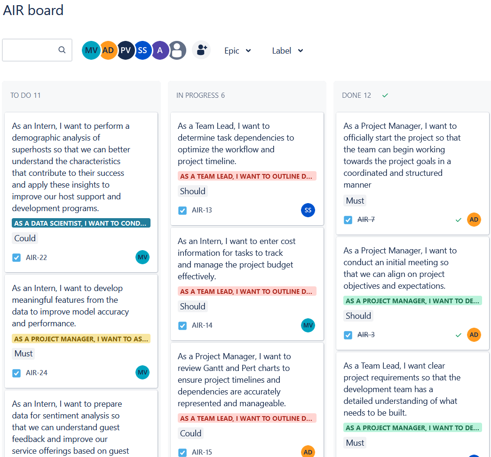
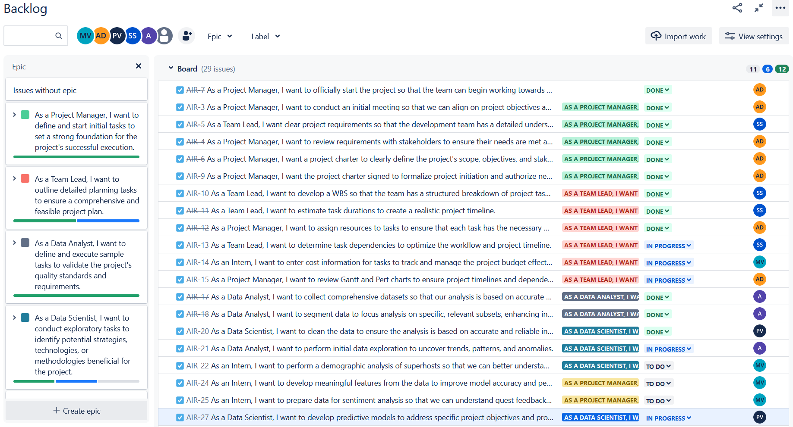

# Project Management Dashboard

## Overview
The project, managed using MS Project, focuses on two main business problems: evaluating Airbnb's superhost status criteria and conducting a tract-level analysis to optimize booking processes. Our team has implemented a comprehensive project plan that includes data collection, segmentation, feature engineering, and advanced analytics techniques such as sentiment analysis and machine learning.

## Features
- **Kanban Board**: Visual representation of task progress across stages: To Do, In Progress, and Done.
- **Task Management**: Detailed insights into task responsibilities and statuses, helping the team to stay organized and focused.
- **Backlog Management**: Organized view of all pending tasks that need to be prioritized and scheduled for action.

## Screenshots

### Project Board

### Backlog View

## Usage
- **Viewing Tasks**: Tasks can be viewed by their current status: To Do, In Progress, or Done.
- **Updating Tasks**: Move tasks across the board to update their status as work progresses.
- **Filtering and Searching**: Use the filter and search options to quickly find tasks or set priorities.

## Contributing
Contributions are welcome. If you have suggestions to improve the marketing strategies, please open an issue or submit a pull request.

## License
This project is released under the MIT License.

## Contact
For any queries, you can reach out to [Mourya Gupta Vakacharla](mailto:mvakacha@purdue.edu).

## Acknowledgments
- Aravind Teja Chikoti
- Vishnu Vardhan Ponduri
- Avishek Das Gupta
- Sohan Sahoo

